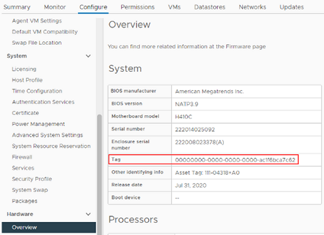

= Localisation d'une balise matérielle pour un nœud de calcul
:hardbreaks:
:allow-uri-read: 
:nofooter: 
:icons: font
:linkattrs: 
:imagesdir: ../media/

[role="lead"]
Vous avez besoin de la balise matérielle pour ajouter vos ressources de nœud de calcul à la configuration du nœud de gestion à l'aide de l'interface utilisateur de l'API REST.

[role="tabbed-block"]
====
.VMware vSphere 8.0 et 7.0
--
Localisez le tag matériel d'un nœud de calcul dans VMware vSphere Web client 8.0 et 7.0.

.Étapes
. Sélectionnez l'hôte dans le navigateur vSphere Web client.
. Sélectionnez l'onglet *configurer*.
. Dans la barre latérale, sélectionnez *matériel* > *Présentation*. Vérifiez si l'étiquette matérielle est répertoriée dans le `System` tableau.
+

. Copiez et enregistrez la valeur pour *Tag*.
. xref:task_mnode_add_assets.adoc[Ajoutez vos ressources de calcul et de contrôleur au nœud de gestion].

--
.VMware vSphere 6.7 et 6.5
--
Localisez le tag matériel d'un nœud de calcul dans VMware vSphere Web client 6.7 et 6.5.

.Étapes
. Sélectionnez l'hôte dans le navigateur vSphere Web client.
. Sélectionnez l'onglet *moniteur* et sélectionnez *Santé du matériel*.
. Vérifiez si l'étiquette est répertoriée avec le fabricant et le numéro de modèle du BIOS.
+
image:../media/hw_tag_67.PNG["Capture d'écran de la table système"]

. Copiez et enregistrez la valeur pour *Tag*.
. xref:task_mnode_add_assets.adoc[Ajoutez vos ressources de calcul et de contrôleur au nœud de gestion].

--
====